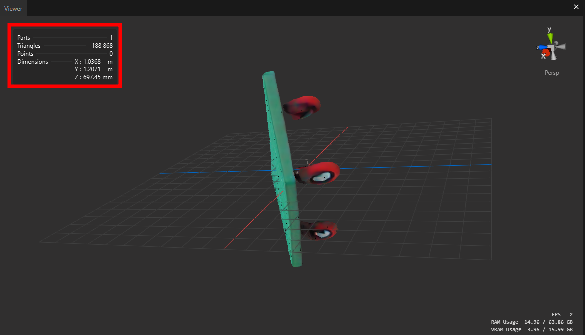
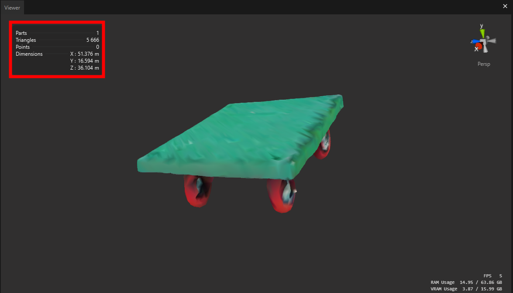

# Pixyz Studio and SDK Sample Script

This repository contains sample scripts for Pixyz Studio and SDK. After running the 3D reconstruction model, you might encounter some issues such as:

- The model having too many polygons
- Incorrect transformation matrices
- And other potential problems

In such cases, you can utilize Pixyz's powerful Python scripting features to automate these processes and resolve these issues efficiently.

### Before

### After

## Documentation

For more detailed information about the Pixyz SDK, please refer to the official documentation [here](https://www.pixyz-software.com/documentations/html/2024.2/sdk/apidoc/python/algo.html).
