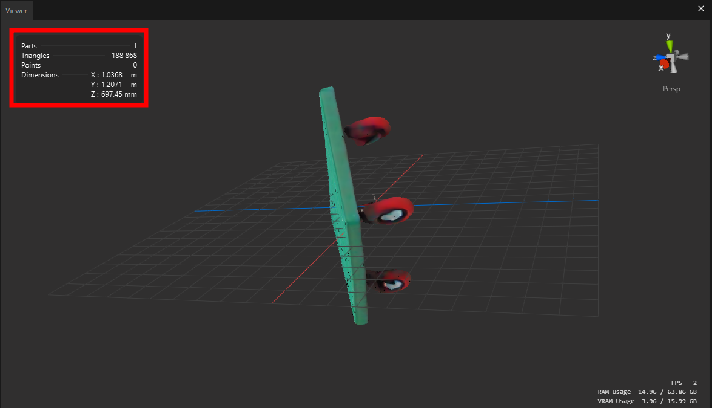
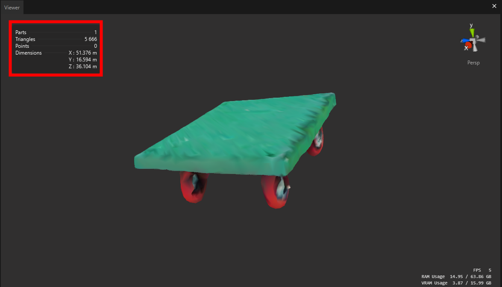

# Pixyz Studio and SDK Sample Script

This repository contains sample scripts for Pixyz Studio and SDK. After running the 3D reconstruction model, you might encounter some issues such as:

- The model having too many polygons
- Incorrect transformation matrices
- And other potential problems

In such cases, you can utilize Pixyz's powerful Python scripting features to automate these processes and resolve these issues efficiently.

### Before

### After

- Cleaned hierarchy
- Deleted empty trees (occurrences)
- Applied proper transformation matrix (transform, rotation, and scale)
- Moved object to the center of origin
- Aligned pivot point to the center of origin
- Decimated polygons
- Created and applied materials with baked texture
- Exported object in the desired format

### Unity Editor with gltFast
.png)

Once you export your model as glb file you can import it with Unity and [gltFast package](https://docs.unity3d.com/Packages/com.unity.cloud.gltfast@6.8/manual/installation.html) which support glb's vertexcolor.
If you are interested in generating shader graph were used to represent the vertex color please refer Sky kim's [shap-e-unity](https://github.com/skykim/shap-e-unity/tree/main)

## Documentation

For more detailed information about the Pixyz SDK, please refer to the official documentation [here](https://www.pixyz-software.com/documentations/html/2024.2/sdk/apidoc/python/algo.html).
You can also find more detailed article that I wrote [here](https://pnltoen.tistory.com/entry/Pixyz-Pixyz-SDK-%EC%86%8C%EA%B0%9C-%EB%B0%8F-Python%EC%9D%84-%ED%86%B5%ED%95%9C-AI-%EA%B8%B0%EB%8A%A5-%ED%99%9C%EC%9A%A9%ED%95%98%EA%B8%B0-TripoSR)
